# ⚡ Novo SEI (Sistema Eletrônico de Informações Modernizado)

O **Novo SEI** é uma evolução conceitual e arquitetural do Sistema Eletrônico de Informações (SEI) legado. Desenvolvido em **.NET 8 (C#)** e **Blazor Interactive Server**, o projeto substitui o monólito legada em PHP por uma arquitetura moderna, escalável, segura e orientada a microsserviços/DDD (Domain-Driven Design).

---

## 📊 Comparativo: SEI Legado vs. Novo SEI

| Aspecto | SEI Legado (PHP) | Novo SEI (.NET 8 / C#) |
| :--- | :--- | :--- |
| **Arquitetura** | Monólito com acoplamento forte entre SEI, SIP e INFRA, dependendo de rotinas em PHP estruturado. | **Clean Architecture & DDD**: Separação clara em projetos `Core` (domínio), `Infrastructure` (acesso a dados e serviços) e `Web` (Blazor Server). |
| **Auditoria e Histórico** | Log de auditoria via triggers de banco de dados ou logs inseridos manualmente pela aplicação. | **Tabelas Temporais Nativas (SQL Server)**: Auditoria automática pelo banco de dados (`IsTemporal()`), permitindo consultas históricas em qualquer ponto do tempo. |
| **Resiliência e Escala** | Processos síncronos e gargalos de concorrência que travam o banco (locks de tabelas frequentes). | **Processamento Assíncrono**: Uso de `BackgroundWorkers` periódicos, filas locais, caching distribuído (`IDistributedCache` com Redis) e operações não bloqueantes. |
| **Segurança e Identidade** | Login básico integrado ao SIP por tabelas compartilhadas e sessões em arquivo. | **Segurança Moderna**: Autenticação desacoplada (LDAP/OIDC), controle de MFA nativo (`TotpService`) e assinaturas digitais criptográficas com hashes SHA-256 gerados no momento da ação. |
| **Interface e UX** | HTML estruturado em tabelas (`<table>`), design anos 2000 e recarregamento total da página a cada clique. | **Blazor Interactive Server + Tailwind/CSS Premium**: Componentização reativa, atualizações parciais do DOM via SignalR, micro-animações, temas modernos (*Indigo/Slate*) e responsividade real. |

---

## 🏛️ Arquitetura do Projeto

O sistema é estruturado utilizando os princípios de **Clean Architecture**, contendo quatro camadas principais:

```mermaid
graph TD
    Web[NovoSei.Web - Blazor UI & Endpoints] --> Infrastructure[NovoSei.Infrastructure - Data Access & Services]
    Infrastructure --> Core[NovoSei.Core - Entities & Interfaces]
    Web --> Core
    Tests[NovoSei.Tests - Testes Automatizados] --> Web
    Tests --> Infrastructure
    Tests --> Core
```



### 📁 Estrutura de Pastas
*   **[NovoSei.Core](file:///C:/Sistemas/Novo-sei/NovoSei.Core)**: Contém as entidades de domínio, regras de negócio e definições de interfaces de serviços. É independente de frameworks externos e de bancos de dados.
*   **[NovoSei.Infrastructure](file:///C:/Sistemas/Novo-sei/NovoSei.Infrastructure)**: Contém o acesso a dados (`ApplicationDbContext` com EF Core), migrações de banco de dados e implementação de serviços concretos (como integração LDAP, gerador de PDF via PuppeteerSharp, serviço de cache distribuído e controle de prazos SLA).
*   **[NovoSei.Web](file:///C:/Sistemas/Novo-sei/NovoSei.Web)**: Contém a interface do usuário Blazor Server, componentes de interface interativos, layouts e endpoints da API.
*   **[NovoSei.Tests](file:///C:/Sistemas/Novo-sei/NovoSei.Tests)**: Suíte abrangente de testes de unidade e de integração para validar a consistência e segurança de todos os serviços.

---

## 🚀 Funcionalidades Principais Implementadas

### 1. Autuação Automatizada e Oficial do NUP
Sempre que um novo processo é iniciado, o sistema gera de forma automática e em segundo plano o **Número Único de Protocolo (NUP)** oficial determinado pela legislação federal brasileira (Portaria Interministerial MJSP/ME nº 11/2019):
*   **Estrutura do NUP (`XXXXX.XXXXXX/AAAA-DD`)**:
    *   `XXXXX` (5 dígitos): Unidade Protocolizadora de Origem (ID da Unidade preenchido com zeros).
    *   `XXXXXX` (6 dígitos): Sequencial linear e cronológico deste ano.
    *   `AAAA` (4 dígitos): Ano corrente.
    *   `DD` (2 dígitos): Dígitos verificadores gerados pelo algoritmo **Módulo 11** com pesos progressivos (`2 a 16` no 1º DV, e `2 a 17` no 2º DV, da direita para a esquerda).

### 2. Metadados Estendidos de Processo
Na autuação, o usuário define campos de metadados fundamentais do fluxo oficial:
*   **Tipo de Processo**: Menu de seleção (*Pessoal: Férias*, *Licitação*, *Contratos*, *Administrativo: Aquisições*...).
*   **Especificação**: Assunto descritivo do processo.
*   **Interessados**: Campo opcional de interessados.
*   **Nível de Acesso**: Classificação do processo (*Público*, *Restrito* ou *Sigiloso*).
*   *Esses dados são expostos por meio de badges estilizados na Caixa de Entrada e no cabeçalho do Visualizador de Processo.*

### 3. Caixa de Entrada Premium
Uma interface rica e fluida contendo:
*   Tabela interativa de processos com marcadores coloridos e visualização de prazos ativos.
*   Seleção múltipla de processos para **ações em lote** (aplicar ou limpar marcadores organizacionais de forma rápida).
*   Acesso direto à árvore de documentos do processo.

### 4. Painel de Dashboard com Cache Inteligente
Página dedicada a estatísticas globais e pessoais:
*   Indicadores em tempo real baseados em consultas eficientes na base de dados (processos abertos, rascunhos, trâmites, etc.).
*   Mecanismo de **caching de 5 minutos** por usuário para otimização de performance.
*   Opção de invalidação de cache automática ao criar/assinar documentos ou por refresh manual na tela.

### 5. Auditoria de Tabelas Temporais
Toda alteração nas tabelas de `Processos`, `Documentos`, `Unidades` e `Marcadores` é rastreada nativamente pelo banco de dados do SQL Server por meio de **System-Versioned Temporal Tables**, fornecendo um histórico inalterável de auditoria com períodos de validade dos registros (`PeriodStart` e `PeriodEnd`).

---

## 🛠️ Como Executar o Projeto

### Pré-requisitos
*   **SDK do .NET 8** instalado.
*   **SQL Server** local (LocalDB) ativo.

### Passo 1: Restaurar Dependências
No diretório raiz da solução, execute:
```bash
dotnet restore
```

### Passo 2: Atualizar Banco de Dados
Para rodar as migrações do EF Core e preparar o banco de dados local com a estrutura de tabelas temporais, execute:
```bash
dotnet ef database update --project NovoSei.Infrastructure --startup-project NovoSei.Web
```

### Passo 3: Executar a Aplicação Web
Entre no diretório do projeto Web e execute:
```bash
cd NovoSei.Web
dotnet run
```
A aplicação iniciará o servidor e estará disponível no endereço:
👉 **`http://localhost:5000`**

---

## 🧪 Executar Testes Automatizados

A suíte de testes do Novo SEI valida regras de negócio críticas (cálculo de prazos, TOTP 2FA, auditoria temporal, controle de blocos de reunião, ingestão e validações de arquivos).

Para executar todos os testes, execute na raiz da solução:
```bash
dotnet test
```
